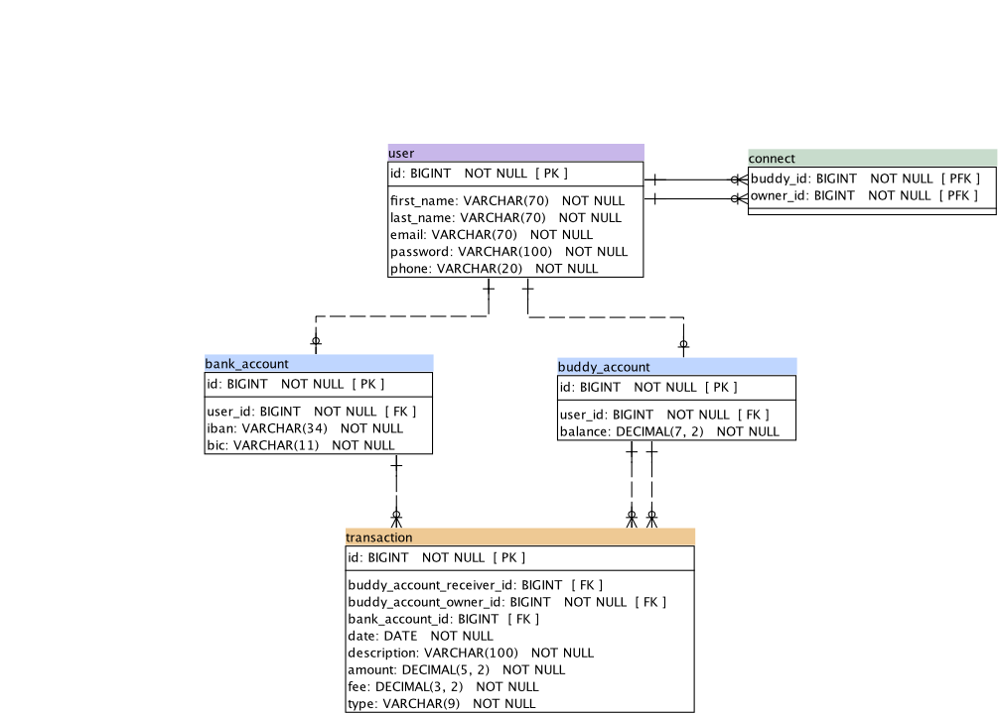
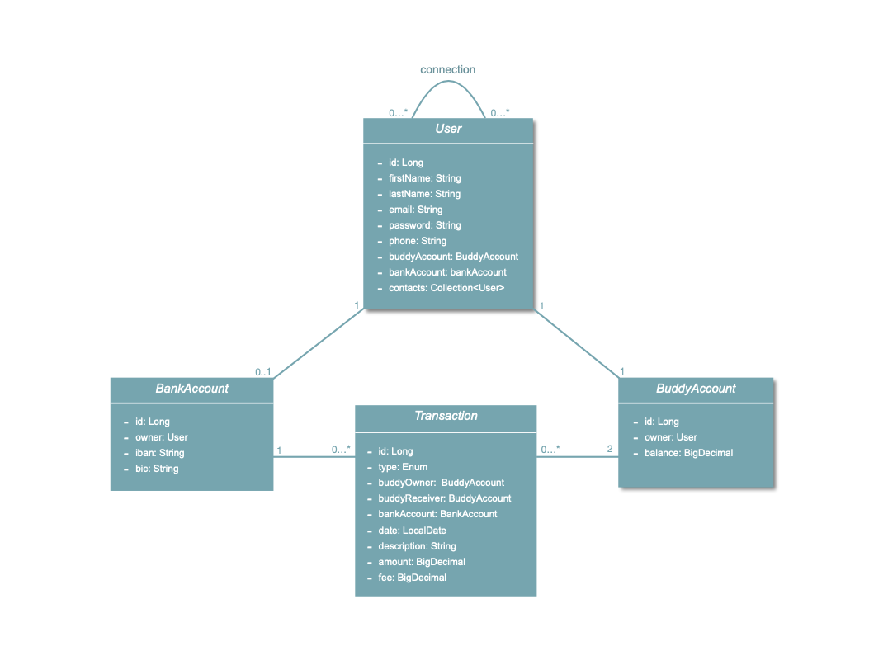

# Pay My Buddy 

Pay My Buddy is an application that allows you to easily transfer money to manage your finance or pay your friends.

## Author

**Laura HABDUL**

## Technologies

 - Spring Boot
 - Spring Security
 - Spring MVC
 - Spring Data JPA
 - Hibernate

## Getting Started
### Prerequisites

Please install the following tools:
- Java 11.
- Maven 4.0.0 
- MySql 8.0.

### Installing 

1. Install Java:

https://www.oracle.com/java/technologies/javase-jdk11-downloads.html

2. Install Maven:

https://maven.apache.org/install.html

3. Install MySql:

https://dev.mysql.com/downloads/mysql/

## Database

Pay My Buddy deal with prod database named «paymybuddy» and test database named «paymybuddy_test ».

- The file **schema.sql** ( in *"/src/main/resources"*) contains SQL instructions  to create prod database.

- The file **schema-test.sql** (in *"/src/test/resources"*) contains scrypt SQL to create "test" database and contains dummies data for tests.

## Testing

To get all the different reports in html format, you need to run either the `mvn site` command.
 This will get you a JaCoCo report, SureFire report as well as a SpotBugs report.

## Endpoint

Version 1.0

- Sign-up endpoint -> POST - http://localhost:8080/registration
- Login endpoint -> POST - http://localhost:8080/login
- Add a contact endpoint -> POST - http://localhost:8080/contact
- Add a bank account endpoint -> POST - http://localhost:8080/bankAccount
- Transfer money to bank account endpoint -> POST - http://localhost:8080/transfer
- Recharge balance endpoint-> POST - http://localhost:8080/recharge
- Pay a buddy endpoint -> POST - http://localhost:8080/payment

## MPD

## Class Diagram

